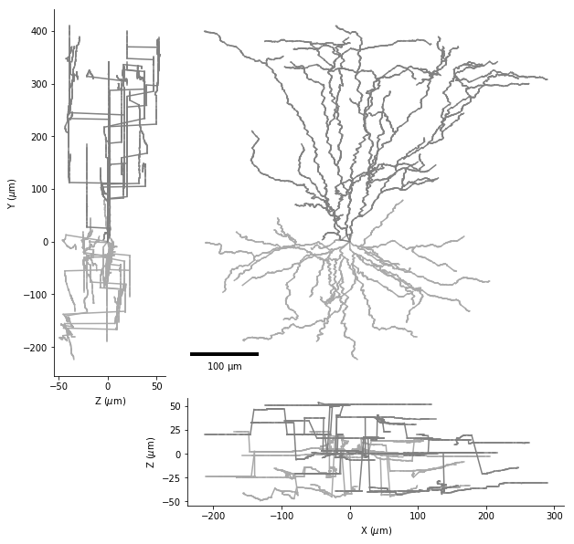
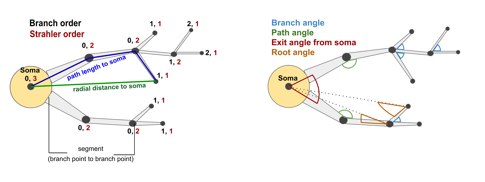

# Summary

Summarizing the anatomy of a neural cell type has been one of the oldest ways to describe differences in neural populations.
However, the quantitative analysis of neuronal morphologies persists to be a hard problem. It usually begins with choosing a
particular feature representation in order to make individual morphologies amenable to classical data analysis. Many
different feature representations have been suggested in the literature, such as density maps [jefferis:2007], single valued summary
statistics (morphometrics) [scorcioni:2008; @NeuroM] or, more recently, persistence images [@li:2017; @kanari:2018].
The tools for extracting them, however, are often focused on solely one such representation and written in various
programming languages.

Our software package `MorphoPy` is meant to easily extract different feature representations from neural morphologies for
downstream statistical analysis. It bundles common representations such as density maps, morphometrics, morphometric distributions
and persistence images in one simple open source framework to make them accessible to a large community. `MorphoPy`
can be used either as a standalone command line tool or as a Python package within a scientific workflow.

TODO
Add brief summary of functionality
Write about command line tool
Idea: take one file and show the data representations


`MorphoPy` builds on the functionality of the networkx package [CITATION] and represents each neuron as a
directed acylic tree graph with node and edge attributes (\autoref{fig:attributes}). The package supports a
plotting routine that shows all three two-dimensional projections at once.
```python
import MorphoPy.NeuronTree as nt
from MorphoPy.computation import file_manager as fm

N = fm.load_swc_file("../data/EC3-80604.CNG.swc")
Dendrites = N.get_dendritic_tree()

from neurontree.plotting import show_threeview
fig = plt.figure(figsize=(10,10))
show_threeview(N, fig)
```

As can be seen in the code snippet, it is possible to split the reconstruction into its different parts (axon or dendrites only)
and operate on each neurite type separately.

Density maps are computed on the basis of a configuration file (or dictionary) that controls parameters such as bin size,
normalization ranges and which cardinal axes to project on. The xy-density map of the dendrite plotted above, for example,
would look like ...

TODO Add density map figure (maybe just xy with different bin sizes and w and wo smoothing)


A variety of statistics can be computed on the nodes and edges of each reconstruction (\autoref{fig:morphometrics}).
The `get_morphometric_statistics()`-method offers a precompiled single valued selection of these statistics, but in principle,
they can be adjusted to the user's personal preference.
Additionally, it is possible to query the entire distribution of each statistic either in form of a histogram or as a
Gaussian kernel density estimate (kde). Fig. XXX, for example, shows the kde of radial distances, branch angles and their
combination for the dendrites shown in \autoref{fig:plot}.

Persistence. Persistence diagrams are a fairly recent way of describing neural morphologies [CITATIONS]. MorphoPy supports the generation of 2D persistence diagrams.
Defined on the basis of a distance function f. We offer four functions to choose from by default but users can specify
their own.


For a full description of `MorphoPy`'s functionality please refer to our documentation and tutorial on our [gitHub page](https://github.com/berenslab/MorphoPy).

`MorphoPy` can read in files or entire batches and compute a specified feature representation using the command line:
```bash
MorphoPy -c [density|persistence|stats] -f ./data/EC3-80604.CNG.swc
```
SUMMARIZING SENTENCE.

`MorphoPy` has been developed in the context of a benchmarking study for cortical interneuron cell type classification
based on their morphology [@laturnus:2019]. It has already been used in a series of scientific publications that tried
to relate transcriptome, electrophysiology and morphology of cortical interneurons in V1 and M1 [@scala:2019; @scala:2020].


# Acknowledgements

This work was funded by the German Ministry of Education and Research(FKZ 01GQ1601), the German Research Foundation (DFG)
under Germany’s Excellence Strategy (EXC2064/1 – 390727645; BE5601/4-1, SFB 1233 “Robust Vision”, Project number 276693517),
and the National Institute of Mental Health (U19MH114830).

# Reference