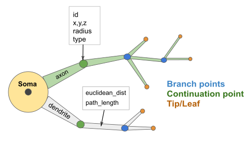
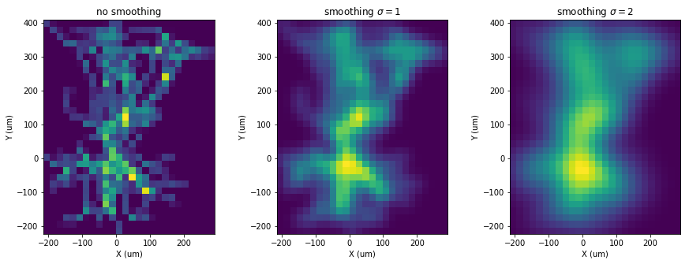
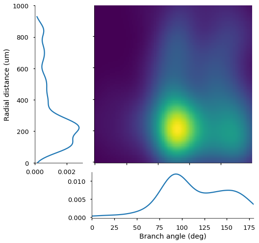

# Summary

For a long time, the anatomy of a neuron has been considered a defining feature of neural cell types.
However, computational analysis of neuronal morphologies persists to be a challenging problem. It usually begins with choosing a
feature representation in order to make individual morphologies amenable to statistical data analysis or to processing by
machine learning methods. Over the years, many different feature representations have been suggested in the literature,
such as density maps [@jefferis:2007], single valued summary statistics (morphometrics) [@scorcioni:2008; @neurom] or,
more recently, persistence images [@li:2017; @kanari:2018].
Unfortunately, current software packages for extracting them from morphological data are often focused on solely one such
representation and implemented across various programming languages.

Our software package `MorphoPy` provides straightforward access to different feature representations from neural morphologies for
downstream statistical analysis. It bundles common representations such as density maps, morphometrics, morphometric distributions
and persistence images in one simple open source framework implemented in Python to make them accessible to a larger community.
`MorphoPy` can be used either as a standalone command line tool or as a package within an interactive computing workflow.



`MorphoPy` builds on the functionality of the networkx package [@hagberg:2008] and represents each neuron as a directed
acyclic tree graph with node and edge attributes \autoref{fig:attributes}. The package supports to read in files in the common
[swc-format](http://www.neuronland.org/NLMorphologyConverter/MorphologyFormats/SWC/Spec.html), offers functions to
compute various feature representations and provides 2D plotting routines for data exploration (\autoref{fig:plot}).
```python

from morphopy.neurontree import NeuronTree as nt
from morphopy.computation import file_manager as fm

N = fm.load_swc_file("../data/EC3-80604.CNG.swc")
Dendrites = N.get_dendritic_tree()

from morphopy.neurontree.plotting import show_threeview
fig = plt.figure(figsize=(10,10))
show_threeview(N, fig)
```


As shown in the code snippet above, it is also possible to split the reconstruction into its different parts (axon or dendrites only)
and operate on each neurite type separately. 

Currently, MorphoPy supports the following feature representations:

_Density maps_ are computed on the basis of a configuration file (or a dictionary) that controls parameters such as bin size
and binning ranges. Additionally, users can specify whether and to which degree
they want to smooth each density map (see \autoref{fig:dms}).



A variety of _morphometric statistics_ can be computed on the nodes and edges of each reconstruction.
The `get_morphometric_statistics()`-method offers a precompiled single valued selection of these statistics including e.g.
min/max branch angles, maximal branch order, and maximal path length to the soma (see \autoref{fig:morphometrics}), but in principle, they can be adjusted to the user's personal preference.


Additionally, it is possible to query the entire _morphometric distribution_ of each statistic either in form of a histogram or as a
Gaussian kernel density estimate (kde). Fig. \autoref{fig:morphdist}, for example, shows the kde of radial distances, branch angles and their
combination for the dendrites shown in \autoref{fig:plot}.



Furthermore, `MorphoPy` supports the generation of _2D persistence diagrams_. Persistence diagrams describe the branching
of neural morphologies [@li:2017; @kanari:2018] with respect to a specified distance function. By default, `MorphoPy`
computes a persistence diagram based on the radial distance from the soma, but users can choose from four different
pre-implemented distance functions (radial distance, path length, height or branch order) or provide their own.

```python
from morphopy.computation.feature_presentation import get_persistence

import numpy as np
def custom_distance(G, u, v):
    """
    Returns a distance between nodes u and v, 
    which both are part of the graph given in G.
    """
    n = G.node[u]['pos']
    r = G.node[v]['pos']
    return np.dot(n, r)

df = get_persistence(Dendrites.get_topological_minor())
df_custom = get_persistence(Dendrites.get_topological_minor(), f=custom_distance)
```

In addition to working as a package in interactive computing environments, `MorphoPy` can be called from the command line
to operate on single files or entire batches.
```bash
MorphoPy.py -c [density|persistence|stats] 
            -i ['path_to_file'|'path_to_folder']
```
For a full documentation of `MorphoPy`'s functionality please refer to our [documentation](https://morphopy.readthedocs.io/en/latest/) and tutorial on our [gitHub page](https://github.com/berenslab/MorphoPy).

`MorphoPy` has been developed in the context of a benchmarking study for cortical interneuron cell type classification
based on their morphology [@laturnus:2019]. It has already been used in a series of scientific publications that relate
transcriptome, electrophysiology and morphology of cortical interneurons in V1 and M1 [@scala:2019; @scala:2020].

# Acknowledgements

This work was funded by the German Ministry of Education and Research(FKZ 01GQ1601), the German Research Foundation (DFG)
under Germany’s Excellence Strategy (EXC2064/1 – 390727645; BE5601/4-1, SFB 1233 “Robust Vision”, Project number 276693517),
and the National Institute of Mental Health (U19MH114830).

# References
